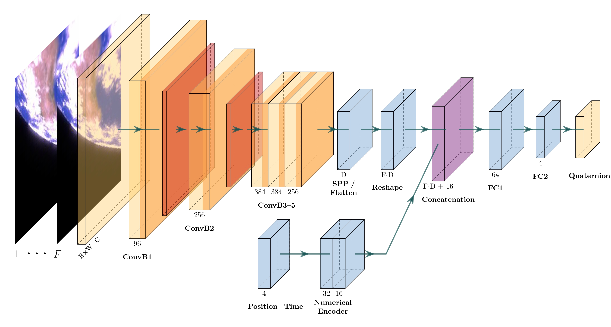

# satellite-image-pose-estimation

## Model Architecture
<p align="center">
  
</p>

## Micromamba Setup Guide

This guide provides step-by-step instructions to install and set up **micromamba**, a lightweight package manager for managing Conda environments. Micromamba is a tiny version of the Mamba package manager that can be installed without admin rights and is suitable for use in containers or continuous integration pipelines.

### Installation

Install micromamba using the provided installer script:

**Using `curl`:**

```bash
curl micro.mamba.pm/install.sh | bash
```

### Creating and Managing Environments

#### Creating a New Environment

Create an environment named `thesis` with Python 3.10:

```bash
micromamba create -n thesis python=3.10
```

#### Activating an Environment

Activate the environment:

```bash
micromamba activate thesis
```

#### Installing Packages

Install packages into the active environment:

```bash
micromamba install -f environment.yml
```

#### Deactivating the Environment

Deactivate the current environment:

```bash
micromamba deactivate
```

## Usage

Run the script using the command line:

```bash
python src/main.py --data_path <path_to_dataset> [options]
```

### Options

| Argument             | Type    | Description                                             | Default      | Choices                                    | Required |
|----------------------|--------|---------------------------------------------------------|-------------|--------------------------------------------|----------|
| `--data_path`       | `str`  | Path to the dataset                                    | N/A         | N/A                                        | ✅        |
| **Data Parameters** |        |                                                         |             |                                            |          |
| `--train_split`     | `float` | Ratio of training data split                           | `0.8`       | `0` to `1`                                | ❌        |
| `--validation_split`| `float` | Ratio of validation data split                         | `0.0`       | `0` to `1`                                | ❌        |
| `--model`          | `str`  | Feature matching method                                 | `'grayscale'` | `'grayscale'`, `'relative_pose'`             | ❌        |
| **Training Parameters** |     |                                                         |             |                                            |          |
| `--batch_size`      | `int`  | Batch size for training                               | `32`        | N/A                                        | ❌        |
| `--frames`          | `int`  | Number of frames per burst                            | `3`         | N/A                                        | ❌        |
| `--channels`       | `int`  | Number of channels per image                          | `1`         | N/A                                        | ❌        |
| `--epochs`         | `int`  | Number of training epochs                             | `100`       | N/A                                        | ❌        |
| `--lr`            | `float` | Learning rate for optimizer                           | `0.001`     | N/A                                        | ❌        |
| `--optimizer`     | `str`  | Optimizer for training                                | `'adam'`    | `'adam'`, `'sgd'`, `'rmsprop'`            | ❌        |
| `--loss`         | `str`  | Loss function for training                           | `'quaternion'` | `'quaternion'`, `'angular'`, `'detailed'`, `'geodesic'` | ❌  |
| **Output Parameters** |      |                                                         |             |                                            |          |
| `--model_save_path`| `str`  | Path to save the trained model                         | `None`      | N/A                                        | ❌        |
| `--log_dir`       | `str`  | Directory for tensorboard logs                        | `'./logs'`  | N/A                                        | ❌        |
| **Miscellaneous Parameters** | |                                             |             |                                            |          |
| `--seed`          | `int`  | Random seed for reproducibility                        | `42`        | N/A                                        | ❌        |


### Examples

#### Example 1: Basic Usage with Relative Pose Model

```bash
python src/main.py --data_path ../satellite-image-generation/SyntheticImages --model relative_pose --frames 5 --channels 3
```

#### Example 2: Customized Training Parameters

```bash
python src/main.py --data_path /path/to/data \
                 --batch_size 64 \
                 --lr 0.001 \
                 --epochs 200 \
                 --loss geodesic
```
---

## Notes

- **CUDA and TensorFlow GPU Support**: If you plan to run the script on a GPU, ensure that CUDA and cuDNN are properly installed and that TensorFlow is built with GPU support.

- **Environment Variables**: The script modifies environment variables that are crucial for TensorFlow to find CUDA libraries. If you encounter issues, double-check the paths and adjust `cuda_env_path` accordingly.
---