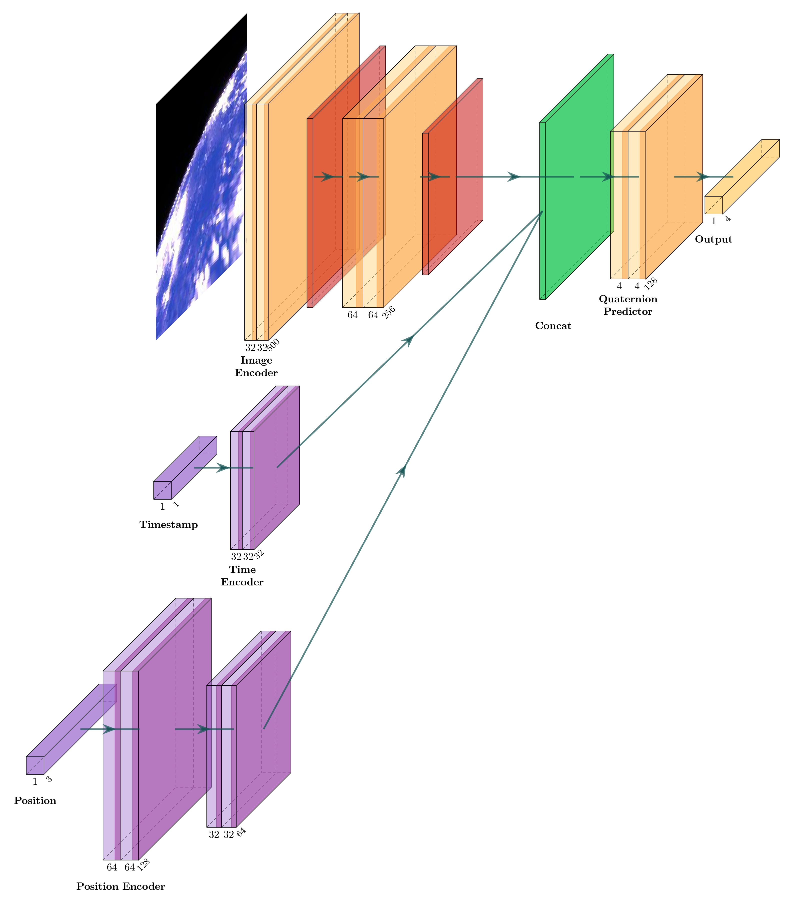

# satellite-image-pose-estimation

## Model Architecture
<p align="center">
  
</p>

## Micromamba Setup Guide

This guide provides step-by-step instructions to install and set up **micromamba**, a lightweight package manager for managing Conda environments. Micromamba is a tiny version of the Mamba package manager that can be installed without admin rights and is suitable for use in containers or continuous integration pipelines.

### Installation

Install micromamba using the provided installer script:

**Using `curl`:**

```bash
curl micro.mamba.pm/install.sh | bash
```

### Creating and Managing Environments

#### Creating a New Environment

Create an environment named `thesis` with Python 3.10:

```bash
micromamba create -n thesis python=3.9
```

#### Activating an Environment

Activate the environment:

```bash
micromamba activate thesis
```

#### Installing Packages

Install packages into the active environment:

```bash
micromamba install -f environment.yml
```

#### Deactivating the Environment

Deactivate the current environment:

```bash
micromamba deactivate
```

## Usage

Run the script using the command line:

```bash
python thesis.py --data_path <path_to_dataset> [options]
```

### Required Arguments

- `--data_path` *(str)*: **Path to the dataset**.
  - This argument specifies the location of your dataset that will be used for training.

### Optional Arguments

#### Data Parameters

- `--train_split` *(float)*: Ratio of the dataset to be used for training.
  - **Default**: `0.8`
  - Must be between `0` and `1`.

- `--validation_split` *(float)*: Ratio of the dataset to be used for validation.
  - **Default**: `0.0`
  - Must be between `0` and `1`.

- `--model` *(str)*: Feature matching method to be used.
  - **Choices**: `'grayscale'`, `'light_glue'`
  - **Default**: `'grayscale'`

- `--num_matches` *(int)*: Desired fixed number of matches for feature matching.
  - **Default**: `100`
  - Required if `--model` is `'light_glue'`.

#### Training Parameters

- `--batch_size` *(int)*: Batch size for training.
  - **Default**: `32`

- `--epochs` *(int)*: Number of epochs for training.
  - **Default**: `100`

- `--lr` *(float)*: Learning rate for the optimizer.
  - **Default**: `0.001`

- `--optimizer` *(str)*: Optimizer to be used for training.
  - **Choices**: `'adam'`, `'sgd'`, `'rmsprop'`
  - **Default**: `'adam'`

- `--loss` *(str)*: Loss function for training.
  - **Choices**: `'quaternion'`, `'angular'`, `'detailed'`
  - **Default**: `'quaternion'`

#### Output Parameters

- `--model_save_path` *(str)*: Path to save the trained model.
  - If not specified, the model will not be saved.

- `--log_dir` *(str)*: Directory to store TensorBoard logs.
  - **Default**: `'./logs'`

#### Miscellaneous Parameters

- `--seed` *(int)*: Random seed for reproducibility.
  - **Default**: `42`

### Examples

#### Example 1: Basic Usage with LightGlue Matching

```bash
python thesis.py --data_path ../satellite-image-generation/SyntheticImages --model light_glue --num_matches 100
```

This command runs the script with the dataset located at `../satellite-image-generation/SyntheticImages`, using `light_glue` for feature matching with `100` matches.

#### Example 2: Customized Training Parameters

```bash
python thesis.py --data_path /path/to/data \
                 --batch_size 64 \
                 --learning_rate 0.001 \
                 --epochs 200
```

This command specifies a dataset, increases the batch size to `64`, sets the learning rate to `0.001`, and trains for `200` epochs.

---

## Notes

- **CUDA and TensorFlow GPU Support**: If you plan to run the script on a GPU, ensure that CUDA and cuDNN are properly installed and that TensorFlow is built with GPU support.

- **Environment Variables**: The script modifies environment variables that are crucial for TensorFlow to find CUDA libraries. If you encounter issues, double-check the paths and adjust `cuda_env_path` accordingly.

- **Feature Matching Dependency**: Currently, only `'light_glue'` is supported. Ensure that the necessary dependencies for LightGlue are installed and accessible.

---